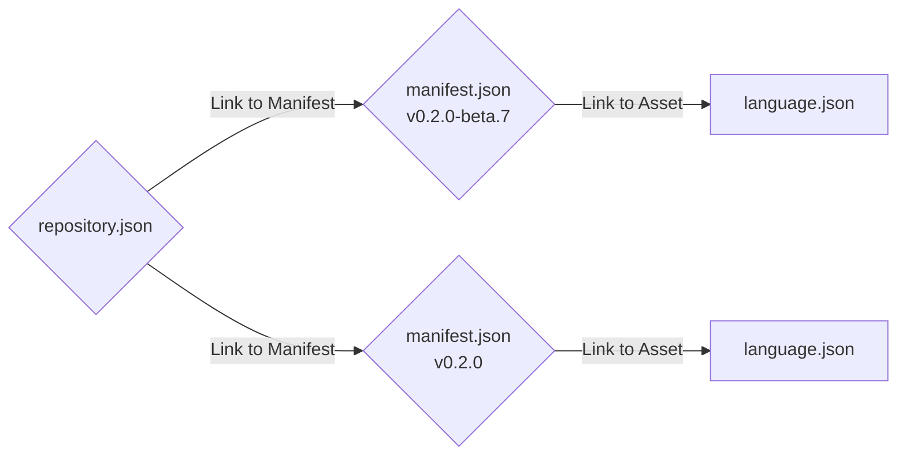

# Tech Giants Mod

To install this mod copy and paste below link into the mod section of Tech Giants Game. 
```
https://rebelliumgames.github.io/TechGiants-Mod-Template/repository.json
``` 

## Steps to create your own mod

1. First create your own copy of the template, [Create a new repository from Template](https://github.com/new?template_name=TechGiants-Mod-Template&template_owner=RebelliumGames).
2. In `Repository name` field write your mod name.
3. Then click on **Create repository**.
4. To classify your mod repository and make it easily discoverable, add `tech-giants` and `mod` [topics](https://docs.github.com/en/repositories/managing-your-repositorys-settings-and-features/customizing-your-repository/classifying-your-repository-with-topics#adding-topics-to-your-repository)
5. Next enable github pages for your repository by going to **Settings tab** and scroll down to the **Pages** section.
6. Under **Branch** which is set to `None` select `main` then **Save**.
7. It might take a minute for you changes to take affect and be deployed to GitHub Pages.
8. Using your browser visit `https://username.github.io/repository/repository.json`.

9. You can edit the files on GitHub or clone/download them locally edit them, then upload/push them back to GitHub.
10. Make sure to have a unique ID for your mod, you can get one [here](https://rebelliumgames.github.io/TechGiants-Mod/) and put it in the `uuid` section of your `manifest.json`. 

    > **Warning!** all your `manifest.json` files must have the exact same **uuid**

If you want your mod to be automatically installed in the game, ask the developers to include your mod in this [list](https://rebelliumgames.github.io/TechGiants-Mod/preinstall-mod-repositories.json). and set `discoverable` to `true` in `repository.json`.

Below is a diagram illustrating the structure and connections between the files:


If you incounter any problem please visit the [Dicord server](https://discord.gg/hexEVAxBJr) and ask the community for help.